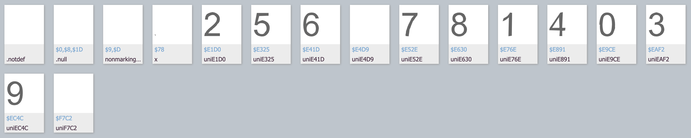
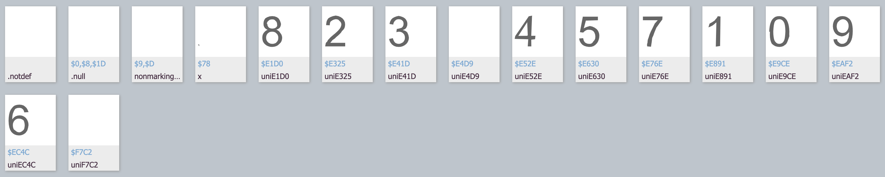

# secondhand-car-price-prediction

## 开题报告
1. 题目（初步）：基于[天池的二手车价格预测](https://tianchi.aliyun.com/competition/entrance/231784/introduction)做出的创新与思考。
2. 理解：虽然二手车价格一直是一个常被提起的问题，但是近几年随着国家政策的出台，各种新能源汽车抢占传统汽油车市场，以及不同地区（尤其是针对中国本土）的二手车价格是否会有较大差别（由于政策、收入等因素的影响）。对比国产新能源汽车与外企的新能源车的二手车价格。
3. 创新点：
    1. 以往的二手车价格预测几乎都是汽油车，没有对于新能源车的价格预测。
    2. 对于天池数据平台的数据，进行一个数据分析
        ```
        0.0    91656
        1.0    46991
        2.0     2212
        3.0      262
        4.0      118
        5.0       45
        6.0       36
        Name: fuelType, dtype: int64
        ```
        对于燃料种类为电动（fuelType = 6）的车其实只占到了36/150000，训练样本太少，所以数据可能不太适合，可能需要重新在二手车平台（尤其是中国的）上爬取数据。
    3. 由于对地区数据进行了脱敏处理，但日常的评估中对于不同城市的电动车价格预测可能会相差较大。
    4. 实现一个可以交互的二手车价格评估预测平台。
4. 官方baseline模型已在`\dataset\tianchi_dataset\dataset-baseline-model.ipynb`中给出，使用决策树模型。
5. 文献阅读总结：
   1. 基于深度学习的二手车价格预测模型及影响分析：
      1. 基于深度神经网络（DNN）模型，采用控制变量法分析交易价格影响因素的重要程度。指导价、使用时间、行驶距离、省份和汽车品牌的重要性分别占67%、13.06%、9.08%、6.22%和4.64%。
      2. 现有的二手车市场交易研究可分为：（1）二手车价值评估，包括影响因素、评估模型、评估应用 等研究。（2）二手车预测， 包括保值率预测、销量预测等研究。
   2. Second Hand Price Prediction for Tesla Vehicles
      1. 针对特斯拉的汽车研究了不同的机器学习技术，如决策树、支持向量机 (SVM)、随机森林和深度学习，并最终通过增强决策树回归实现。
      2. 实现了一个可以预测Tesla汽车价格的网络服务。
6. Baseline：
   1. [采用lightgbm+catboost+neural_network](https://github.com/wujiekd/Predicting-used-car-prices)
   2. [采用LGB+XGBoost](https://github.com/WillianWang2025/UsedCarPricePrediction/blob/master/LGB_and_XGBoost.ipynb)

## 数据获取方法：
1. 以北京地区特斯拉瓜子二手车网站为例：可以抓包获取到瓜子页面api: `https://mapi.guazi.com/car-source/carList/pcList?minor=tesila&sourceType=&ec_buy_car_list_ab=&location_city=&district_id=&tag=-1&license_date=&auto_type=&driving_type=&gearbox=&road_haul=&air_displacement=&emission=&car_color=&guobie=&bright_spot_config=&seat=&fuel_type=&order=&priceRange=0,-1&tag_types=&diff_city=&intention_options=&initialPriceRange=&monthlyPriceRange=&transfer_num=&car_year=&carid_qigangshu=&carid_jinqixingshi=&cheliangjibie=&key_word=%E7%89%B9%E6%96%AF%E6%8B%89&page=1&pageSize=20&city_filter=12&city=12&guazi_city=12&qpres=484192054210134016&versionId=0.0.0.0&osv=IOS&platfromSource=wap`
该网页url中`minor=tesila`可以更改为其他名称（如weila-蔚来，baoma-宝马），并修改`keyword`关键词，实际上`keyword=%E7%89%B9%E6%96%AF%E6%8B%89`中为UTF-8格式，直接解码就是中文特斯拉。我尝试将`minor`改为`weilai`，并将`keyword`改为`%E8%94%9A%E6%9D%A5%0A`（即“蔚来”的UTF-8格式）便可获取到蔚来相关的数据。同时，可以修改`city_filter`，`city`，`guazi_city`即可更改城市，例如`city=13`为上海。将注意此时的网页是很多项目浏览的网页，并不能获取到车辆的详细信息。
2. 进入上述网页后，转换为json格式后，可以看到`post_list`中包含了一个网页里所有的可用车辆，可以轻易得到`clue_id`，将其添加到`https://www.guazi.com/Detail?clueId=`之后可以得到该车辆的详细信息。
3. guazi网页采用的反爬虫方法：有一些字符是以HTML实体的元素存储的，但解码出来是一个方框，比如`"price": "&#58928;&#58397;.&#59537;&#59854;万"`，经过HTML解码后得到".万"，可见并不可用，再将该文字进行UTF-8解码得到"\&#xE630;\&#xE41D;.\&#xE891;\&#xE9CE;\&#x4E07;"，实际上还是不可用的，因为有反爬虫的功能。但是进行后台抓包可以获取到一个"gzfont4.woff2"的字体文件，进行读取后可以看到：

很清楚，每一个unicode编码都对应一个数字字体，所以无法被解码出来。故我们只需要将字体文件中的对应关系找到即可。但是问题又出现了，每一天的gzfont字体文件是不同的，即今天可能是gzfont1，明天可能是gzfont2。比如一个gzfont3文件：


## 算法与模型：
1. 参考

## 待办：
   + 初步研究框架+算法确定
   + 数据集的爬取可能性分析，几种feature，地区等因素，初步的数据集
   + 开题报告大致写完，目的和方法