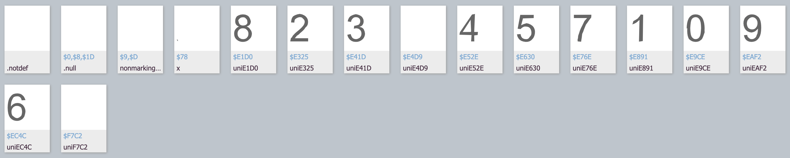
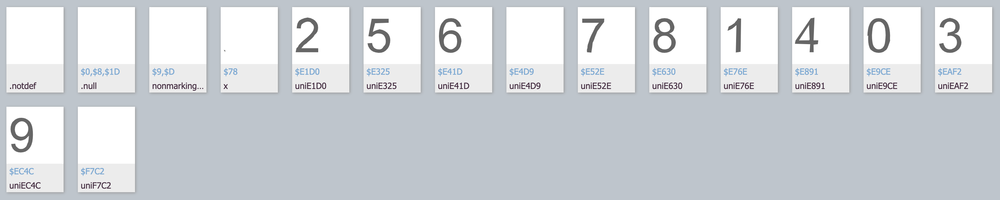
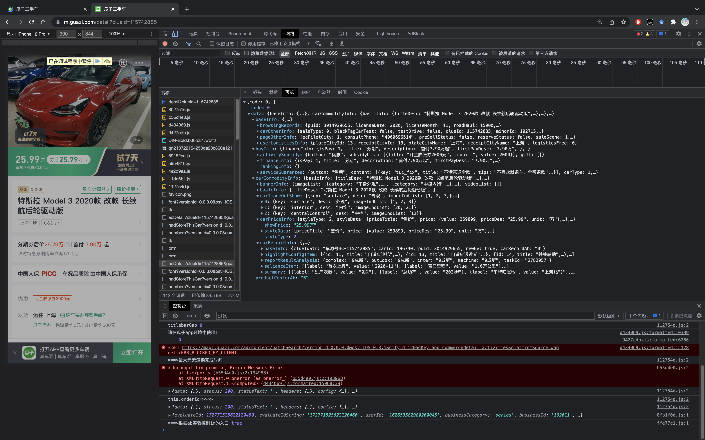
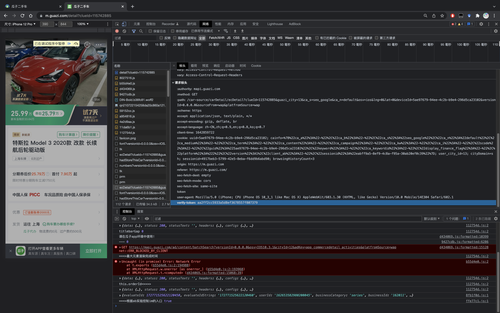
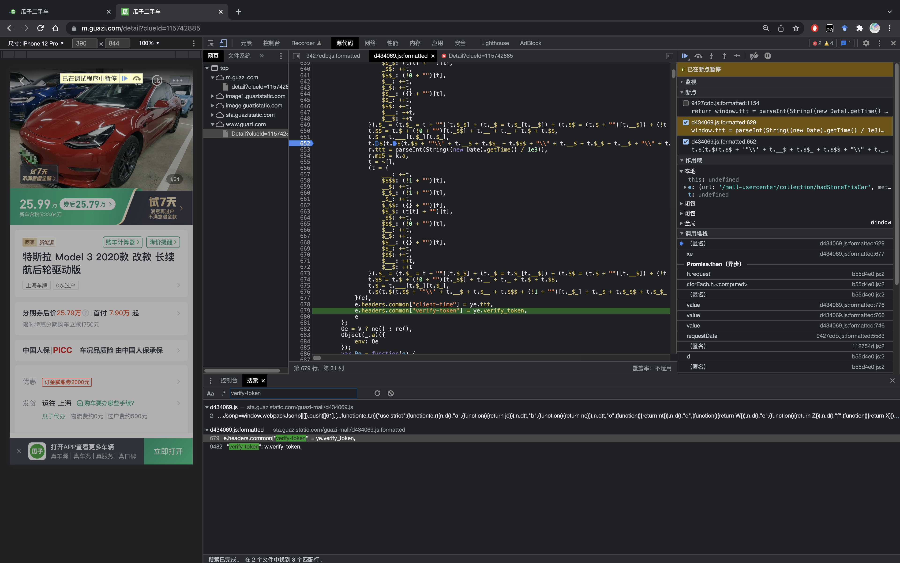
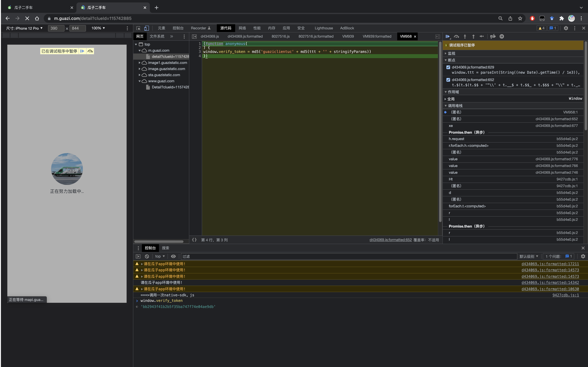
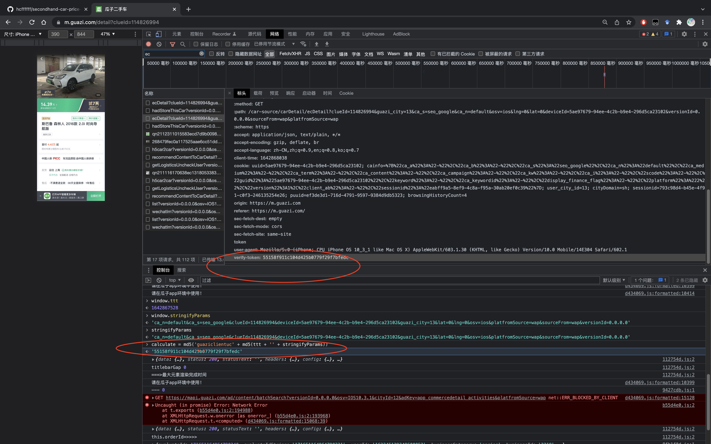
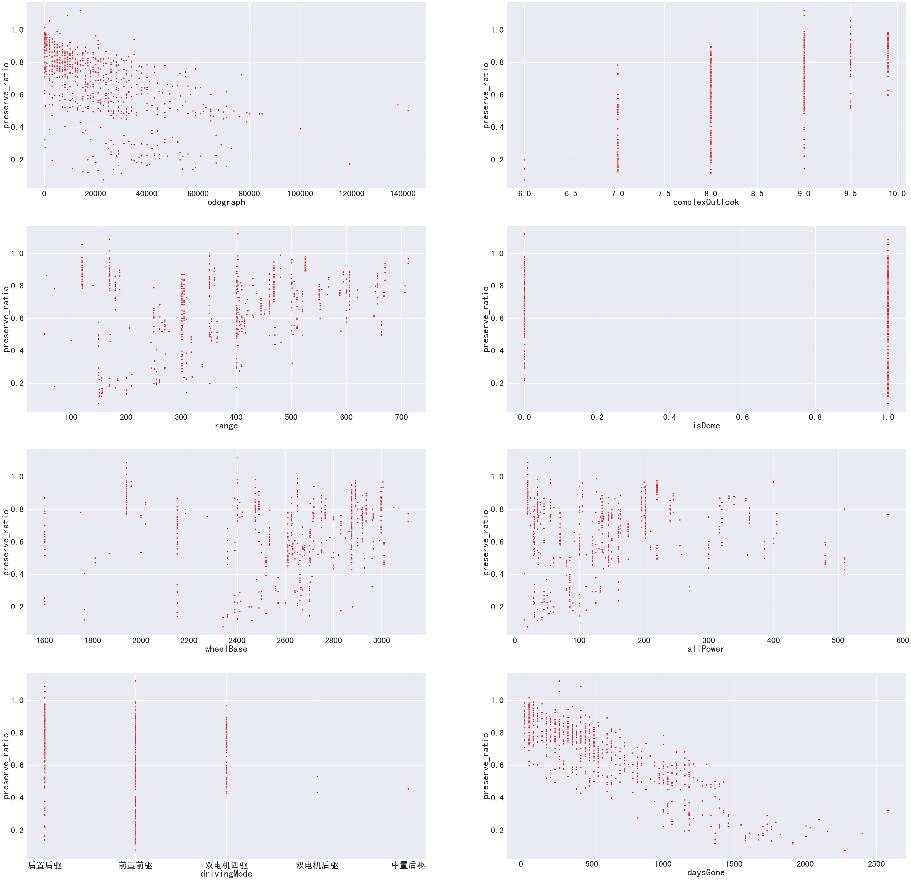
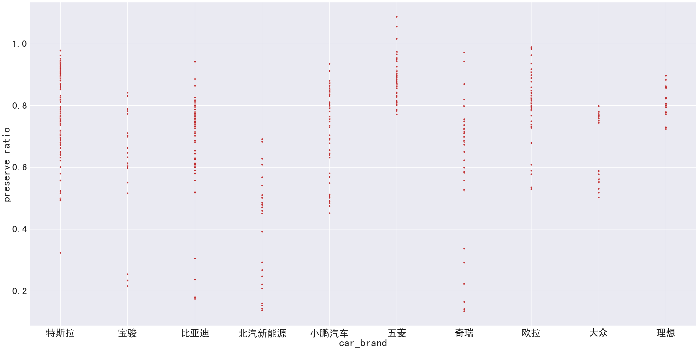
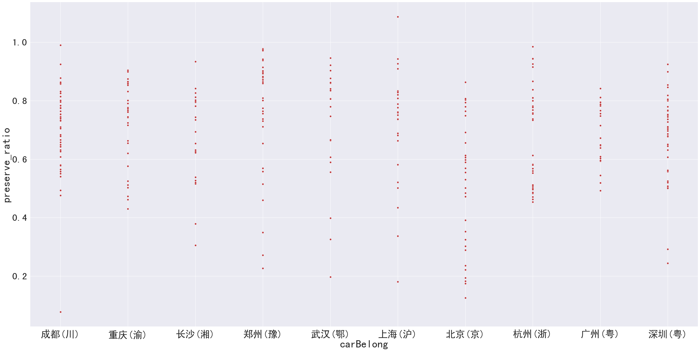

# secondhand-car-price-prediction

## 开题报告
1. 题目（初步）：基于[天池的二手车价格预测](https://tianchi.aliyun.com/competition/entrance/231784/introduction)做出的创新与思考。
2. 理解：虽然二手车价格一直是一个常被提起的问题，但是近几年随着国家政策的出台，各种新能源汽车抢占传统汽油车市场，以及不同地区（尤其是针对中国本土）的二手车价格是否会有较大差别（由于政策、收入等因素的影响）。对比国产新能源汽车与外企的新能源车的二手车价格。
3. 创新点：
    1. 以往的二手车价格预测几乎都是汽油车，没有对于新能源车的价格预测。
    2. 对于天池数据平台的数据，进行一个数据分析
        ```
        0.0    91656
        1.0    46991
        2.0     2212
        3.0      262
        4.0      118
        5.0       45
        6.0       36
        Name: fuelType, dtype: int64
        ```
        对于燃料种类为电动（fuelType = 6）的车其实只占到了36/150000，训练样本太少，所以数据可能不太适合，可能需要重新在二手车平台（尤其是中国的）上爬取数据。
    3. 由于对地区数据进行了脱敏处理，但日常的评估中对于不同城市的电动车价格预测可能会相差较大。
    4. 实现一个可以交互的二手车价格评估预测平台。
4. 官方baseline模型已在`\dataset\tianchi_dataset\dataset-baseline-model.ipynb`中给出，使用决策树模型。
5. 文献阅读总结：
   1. 基于深度学习的二手车价格预测模型及影响分析：
      1. 基于深度神经网络（DNN）模型，采用控制变量法分析交易价格影响因素的重要程度。指导价、使用时间、行驶距离、省份和汽车品牌的重要性分别占67%、13.06%、9.08%、6.22%和4.64%。
      2. 现有的二手车市场交易研究可分为：（1）二手车价值评估，包括影响因素、评估模型、评估应用 等研究。（2）二手车预测， 包括保值率预测、销量预测等研究。
   2. Second Hand Price Prediction for Tesla Vehicles
      1. 针对特斯拉的汽车研究了不同的机器学习技术，如决策树、支持向量机 (SVM)、随机森林和深度学习，并最终通过增强决策树回归实现。
      2. 实现了一个可以预测Tesla汽车价格的网络服务。
6. Baseline：
   1. [采用lightgbm+catboost+neural_network](https://github.com/wujiekd/Predicting-used-car-prices)
   2. [采用LGB+XGBoost](https://github.com/WillianWang2025/UsedCarPricePrediction/blob/master/LGB_and_XGBoost.ipynb)

## 数据获取方法

### 网页属性
1. 以北京地区特斯拉瓜子二手车网站为例：可以抓包获取到瓜子页面api: `https://mapi.guazi.com/car-source/carList/pcList?minor=tesila&sourceType=&ec_buy_car_list_ab=&location_city=&district_id=&tag=-1&license_date=&auto_type=&driving_type=&gearbox=&road_haul=&air_displacement=&emission=&car_color=&guobie=&bright_spot_config=&seat=&fuel_type=&order=&priceRange=0,-1&tag_types=&diff_city=&intention_options=&initialPriceRange=&monthlyPriceRange=&transfer_num=&car_year=&carid_qigangshu=&carid_jinqixingshi=&cheliangjibie=&key_word=%E7%89%B9%E6%96%AF%E6%8B%89&page=1&pageSize=20&city_filter=12&city=12&guazi_city=12&qpres=484192054210134016&versionId=0.0.0.0&osv=IOS&platfromSource=wap`
该网页url中`minor=tesila`可以更改为其他名称（如weila-蔚来，baoma-宝马），并修改`keyword`关键词，实际上`keyword=%E7%89%B9%E6%96%AF%E6%8B%89`中为UTF-8格式，直接解码就是中文特斯拉。我尝试将`minor`改为`weilai`，并将`keyword`改为`%E8%94%9A%E6%9D%A5%0A`（即“蔚来”的UTF-8格式）便可获取到蔚来相关的数据。同时，可以修改`city_filter`，`city`，`guazi_city`即可更改城市，例如`city=13`为上海。将注意此时的网页是很多项目浏览的网页，并不能获取到车辆的详细信息。
2. 进入上述网页后，转换为json格式后，可以看到`post_list`中包含了一个网页里所有的可用车辆，可以轻易得到`clue_id`，将其添加到`https://www.guazi.com/Detail?clueId=`之后可以得到该车辆的详细信息。
### 加密方法
1. guazi网页采用的反爬虫方法：有一些字符是以HTML实体的元素存储的，但解码出来是一个方框，比如`"price": "&#58928;&#58397;.&#59537;&#59854;万"`，经过HTML解码后得到".万"，可见并不可用，再将该文字进行UTF-8解码得到"\&#xE630;\&#xE41D;.\&#xE891;\&#xE9CE;\&#x4E07;"，实际上还是不可用的，因为有反爬虫的功能。但是进行后台抓包可以获取到一个"gzfont4.woff2"的字体文件，进行读取后可以看到：

很清楚，每一个unicode编码都对应一个数字字体，所以无法被解码出来。故我们只需要将字体文件中的对应关系找到即可。但是问题又出现了，每一天的gzfont字体文件是不同的，即今天可能是gzfont1，明天可能是gzfont2。比如一个gzfont3文件：

2. 经过一番资料查询和学习后，我发现这样的情况是因为瓜子网站采用了js签名的反爬虫的方法，因为如果要获取字体再反解析的话会很麻烦，所以改变方法，采用解析网页js，然后获取他的签名加密方法，然后模仿加密方法获取到签名数据，再根据此获取到源文件，具体方法如下：
   1. 在页面加载的内容中可以看到一个显示包含车辆所有数据（名称、价格、排量、里程等）的文稿，但遗憾的是直接请求该网址会显示签名验证失败。
      <center>
         
         <br>
         <div style="color:orange; border-bottom: 1px solid #d9d9d9;
         display: inline-block;
         color: #999;
         padding: 2px;">包含车辆数据的文档</div>
      </center>
   2. 继续查询该文档的请求标头，发现一个字段是其他常规文档没有的：`verify-token`，上网查询后发现就是加密的签名字段，那么只要能用代码实现出这个签名字段就可以获取到该文档数据。
      <center>
         
         <br>
         <div style="color:orange; border-bottom: 1px solid #d9d9d9;
         display: inline-block;
         color: #999;
         padding: 2px;">高亮部分为签名的信息</div>
      </center>
   3. 继续搜索字段`verify-token`可以在js文档中获得该字段数据的获取方法，并得到ye就是该function中的window，然后我们在当前js文件中打几个断点刷新测试一下，看看具体的计算方法：
      <center>
         
         <br>
         <div style="color:orange; border-bottom: 1px solid #d9d9d9;
         display: inline-block;
         color: #999;
         padding: 2px;">高亮部分为verifytoken的信息</div>
      </center>
   4. 终于，在单步调试中可以确定加密字段只与请求时间有关，将下图中的`1642862186`以秒为单位使用unix时间戳转换，恰好得到刚刚的时间`2022-01-22 22:36:26`，而md5加密方法只需将js文档中的内容拷贝下来即可：
      <center>
         
         <br>
         <div style="color:orange; border-bottom: 1px solid #d9d9d9;
         display: inline-block;
         color: #999;
         padding: 2px;">很简单verifytoken的加密函数，并可以在控制台看到两个字段的数值</div>
      </center>
   5. verify_token的计算方法为：`md5('guaziclientuc' + md5(ttt + '' + stringifyParams))`，其中`ttt`为unix时间戳，`stringifyParams`为`'ca_n=default...rceFrom=wap&versionId=0.0.0.0'`，我们根据该公式计算token数值并验证真实性如图：
      <center>
         
         <br>
         <div style="color:orange; border-bottom: 1px solid #d9d9d9;
         display: inline-block;
         color: #999;
         padding: 2px;">可以看见控制台中的手算token与标头中的token完全一样</div>
      </center>
### 数据保存
通过`spider.py`将汽车基础数据和详细属性数据合并，需要说明二者虽然来自不同网页（前者来自`https://mapi.guazi.com/car-source/carDetail/ecDetail?clueId={clueId}&guazi_city=12&ca_s=seo_baidu&ca_n=default&osv=ios&lng=0&lat=0&deviceId=12be6bb1-1b41-4bda-f274-d18b315e9065&versionId=0.0.0.0&sourceFrom=wap&platfromSource=wap`，而后者来自`https://mapi.guazi.com/car-source/carRecord/configurations?versionId=0.0.0.0&osv=ios&clueId={clueId}&deviceid=12be6bb1-1b41-4bda-f274-d18b315e9065&guazi_city=12&platfromSource=wap`，二者都包含可改变自断`clueId`，如前所述，此ID每一个登记车辆都是唯一的），但加密方法和获取数据方法是完全一样的，并以字典形式保存到同一个json文件中，命名为`{clueId}.json`，所有文件可以在`crawl_for_guazi/allData/`目录下查看到。

### 数据筛选
1. 通过阅读文献与属性分析，初步决定保存汽车品牌、具体型号、该二手车售价、新车售价、整体成色、首次上牌日期、已经行驶的里程、车辆总功率、车辆归属地、续航里程、是否为国产、轴距、驱动方式，共684辆纯电动车的数据，这几乎也是瓜子二手车上所有的纯电动车数据了。该文件可以在`crawl_for_guazi/data.csv`中查看。
2. 数据属性说明：
   ```
   RangeIndex: 684 entries, 0 to 683
   Data columns (total 14 columns):
   #   Column          Non-Null Count  Dtype   Meaning
   ---  ------          --------------  -----  ------------
   0   car_name        684 non-null    object  车辆完整型号，如：特斯拉MODEL S 2014款 MODEL S 85
   1   car_brand       684 non-null    object  车辆品牌，如：特斯拉
   2   car_tag         684 non-null    object  车辆品牌下的型号，如：特斯拉MODEL S
   3   price           684 non-null    int64   该二手车价格，单位：元，如：285000
   4   new_price       684 non-null    int64   该车型新车价格（官方指导价），单位：元，如：796735
   5   complexOutlook  684 non-null    object  整体评测外观成色，如：7成新
   6   firstCert       684 non-null    object  首次上牌年月，如：2015-02
   7   odograph        684 non-null    object  表显里程，如：4.7万公里
   8   allPower        684 non-null    object  车辆总功率，如：270kW
   9   carBelong       684 non-null    object  车辆归属地，如：烟台(鲁)	
   10  range           684 non-null    object  续航里程，如：502km
   11  isDome          684 non-null    int64   是否为国产，0/1，如：0
   12  wheelBase       684 non-null    int64   轴距，单位：mm，如：2960
   13  drivingMode     684 non-null    object  驱动方式，如：后置后驱
   dtypes: int64(4), object(10)
   memory usage: 74.9+ KB
   ```

## 数据处理与分析
为了方便后续的模型处理与研究，对上述的数据属性进行清洗与处理

### 数据清洗具体过程
1. 处理外观成色属性字段，将其转换为float类型
2. 将首次上牌日期修改为pandas.datetime形式，并新增一列表示从上牌日期至数据获取日期（2022-01-26）的天数
3. 删除表显里程数的中文，统一为“公里”单位
4. 处理车辆总功率
5. 删除无新车价格数据的行
6. 添加损耗价格与损耗价格率与保值率（二手价格/新车价格）

### 数据分析具体过程
1. 查看折价率为0，保值率>1的车（二手车价格甚至超过新车价格的行）：  
2. 对特征与保值率作图分析：
   
   可以明显看出右下角的使用天数与折价率有较大相关性，具有中等程度的相关性的特征有：表显里程odograph、外观成色complexOutlook、续航里程range，而相关性较弱的特征为是否为国产isDome、轴距wheelBase、总功率allPower、驱动方式drivingMode。
3. 分析数量前十的汽车品牌与保值率的关系：
   
   似乎有一定的聚集的属性，例如特斯拉的保值率高于0.6，五菱的保值率就集中在0.8以上，北汽新能源的保值率可能大概率低于0.6。
4. 分析数量前十的销售地区与保值率的关系：
   
   可见关系性似乎不大。

### 模型建立的考量因素（由高到低）
1. 使用天数
2. 外观成色
3. 表显里程
4. 车辆功率
5. 续航里程
6. 轴距

## 算法与模型：
1. 参考

## 待办：
   + 初步研究框架+算法确定